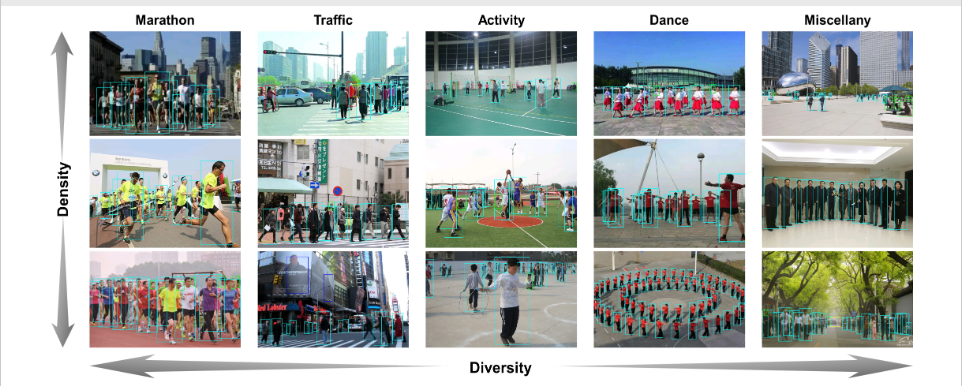
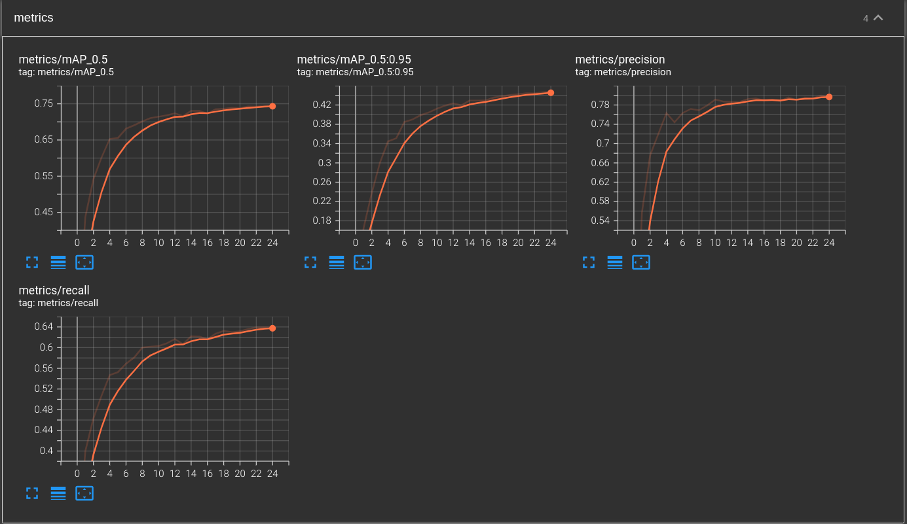
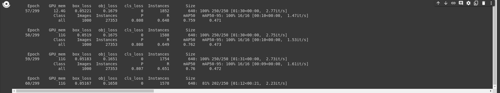
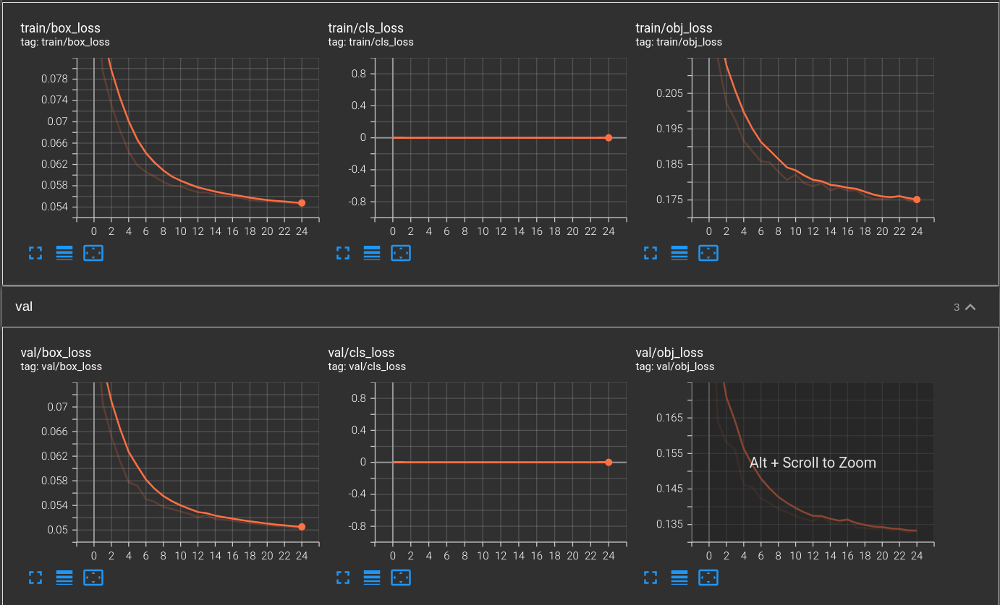
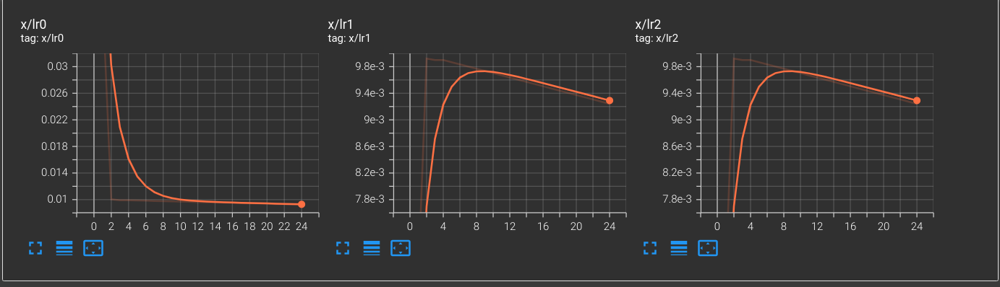
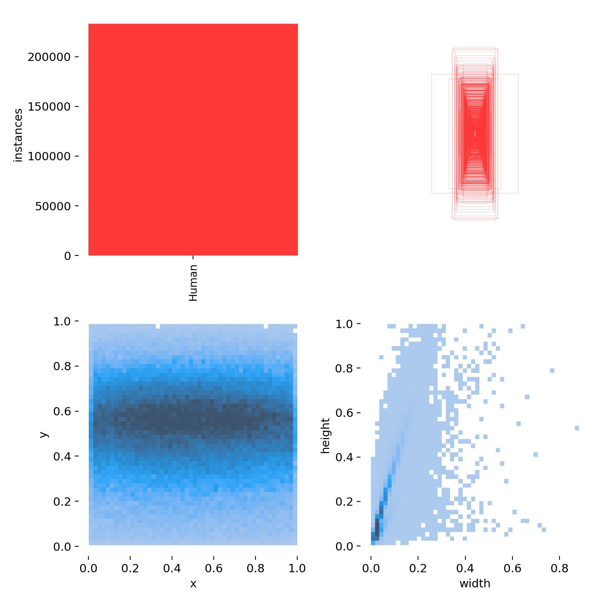
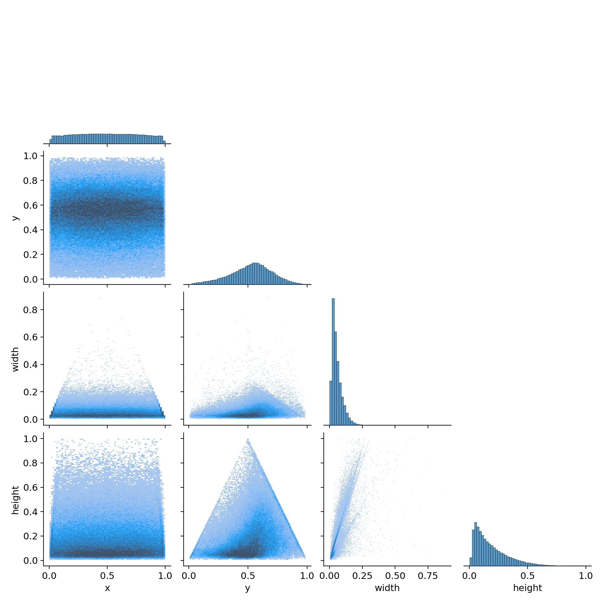
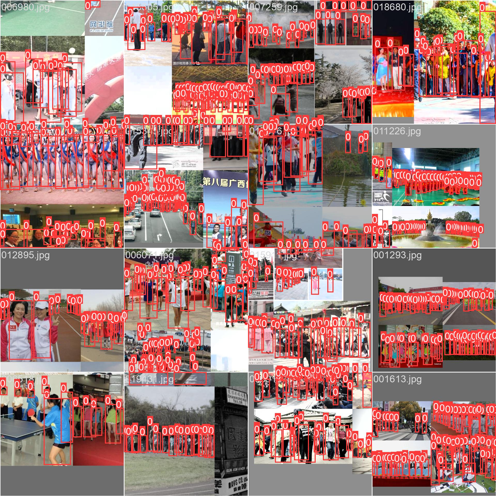

# Human Detection
Human Detection using yolov5m


In this repository I have trained yolov5m on WiderPerson Dataset.


# Introduction

The WiderPerson dataset is a pedestrian detection benchmark dataset in the wild, of which images are selected from a wide range of scenarios, no longer limited to the traffic scenario. We choose 13,382 images and label about 400K annotations with various kinds of occlusions. We randomly select 8000/1000/4382 images as training, validation and testing subsets. Similar to CityPersons and WIDER FACE datasets, we do not release the bounding box ground truths for the test images. Users are required to submit final prediction files, which we shall proceed to evaluate.




<details open>

<summary>Training yolov5m and Dataset Preparation </summary>

The included code, which is in form of Ipython Notebook, downloads the dataset and perform processing.

<summary> Colab Notebook </summary>

The code needed to preprocess the data and train the model is available in the following notebook.
Set the runtime to GPU and run everything.

[](https://github.com/muhammad-umair-usmani/Human_Detection/blob/main/Dataset_Preparation%2BYolov5m_Training.ipynb)

<summary> Yolo Weights and checkpoint to resume training </summary>

The newly trained [weights](https://drive.google.com/file/d/10Rm1bTyP8-bfXCRnE0f6_DZ-TZL-4wvH/view?usp=sharing) are also available to run using the official yolov5 code found [here](https://github.com/ultralytics/yolov5)

# you can find trained model checkpoint, tensorboard logs and weights here: [Link](https://drive.google.com/drive/folders/1Yw9tnRs0LweOGaYGI4SSyUhW0Gf0gGfY?usp=sharing) 

<summary>Finally yolov5m is trained. Below are training metrics and performance images</summary>

<p float="left">
  
  
  
  
</p>

# labels correlogram

<p float="left">
  
  
</p>

# Results
<p float="left">

</p>
</details>

<details>

<summary>Inference</summary>

YOLOv5 [PyTorch Hub](https://docs.ultralytics.com/yolov5/tutorials/pytorch_hub_model_loading) inference. [Models](https://github.com/ultralytics/yolov5/tree/master/models) download automatically from the latest YOLOv5 [release](https://github.com/ultralytics/yolov5/releases).

Find custom trained weights for only pedestrian detection [Link](https://drive.google.com/drive/folders/1Yw9tnRs0LweOGaYGI4SSyUhW0Gf0gGfY?usp=sharing)

```python
import torch

# Model
model = torch.hub.load("ultralytics/yolov5", "yolov5s")  # or yolov5n - yolov5x6, custom

# Images
img = "https://ultralytics.com/images/zidane.jpg"  # or file, Path, PIL, OpenCV, numpy, list

# Inference
results = model(img)

# Results
results.print()  # or .show(), .save(), .crop(), .pandas(), etc.
```
</details>

<details>
<summary>Inference with detect.py</summary>

`detect.py` runs inference on a variety of sources, downloading [models](https://github.com/ultralytics/yolov5/tree/master/models) automatically from the latest YOLOv5 [release](https://github.com/ultralytics/yolov5/releases) and saving results to `runs/detect`.

```bash
python detect.py --weights yolov5s.pt --source 0                               # webcam
                                               img.jpg                         # image
                                               vid.mp4                         # video
                                               screen                          # screenshot
                                               path/                           # directory
                                               list.txt                        # list of images
                                               list.streams                    # list of streams
                                               'path/*.jpg'                    # glob
                                               'https://youtu.be/LNwODJXcvt4'  # YouTube
                                               'rtsp://example.com/media.mp4'  # RTSP, RTMP, HTTP stream
```

</details>


